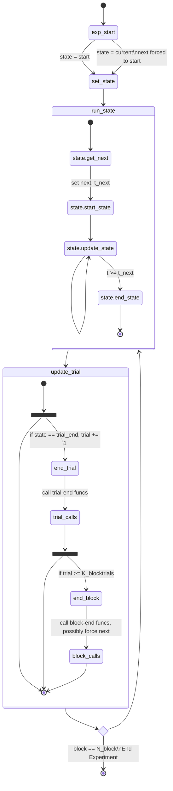

```mermaid
stateDiagram-v2
    [*] --> exp_start
    state exp_start <<choice>>
    exp_start --> set_state: state = start
    exp_start --> set_state: state = current\nnext forced to start
    set_state --> run_state
    state run_state {
    state "state.get_next" as gn_curr
    state "state.start_state" as st_curr
    state "state.update_state" as ud_curr
    state "state.end_state" as ed_curr
    [*] --> gn_curr
    gn_curr --> st_curr: set next, t_next
    st_curr --> ud_curr
    ud_curr --> ud_curr
    ud_curr --> ed_curr: t >= t_next
    ed_curr --> [*]
    }
    state update_trial {
        state tr_check <<fork>>
        [*] --> tr_check
        tr_check --> end_trial: if state == trial_end, trial += 1
        tr_check --> [*]
        end_trial --> trial_calls: call trial-end funcs
        state blk_check <<fork>>
        trial_calls --> blk_check
        blk_check --> end_block: if trial >= K_blocktrials
        blk_check --> [*]
        end_block --> block_calls: call block-end funcs, possibly force next
        block_calls --> [*]
    }
    run_state --> update_trial
    state change_state <<choice>>
    update_trial --> change_state
    change_state --> run_state
    change_state --> [*]: block == N_block\nEnd Experiment
```