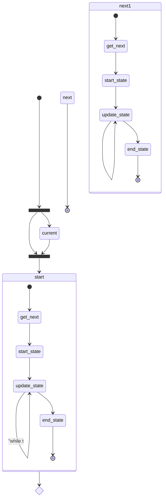

```mermaid
stateDiagram-v2
    state current_or_start <<fork>>
    [*] --> current_or_start
    current_or_start --> current
    state exp_start <<join>>
    current_or_start --> exp_start
    current --> exp_start
    exp_start --> start
    next --> [*]
    state start {
        state "get_next" as gn_start
        state "start_state" as st_start
        state "update_state" as ud_start
        state "end_state" as ed_start
        [*] --> gn_start
        gn_start --> st_start
        st_start --> ud_start
        ud_start --> ud_start: "while t<t_next"
        ud_start --> ed_start
        ed_start --> [*]
    }
    state next_select <<choice>>
    start --> next_select
    next_select    
    state next1 {
        state "get_next" as gn_next1
        state "start_state" as st_next1
        state "update_state" as ud_next1
        state "end_state" as ed_next1
        [*] --> gn_next1
        gn_next1 --> st_next1
        st_next1 --> ud_next1
        ud_next1 --> ud_next1
        ud_next1 --> ed_next1
        ed_next1 --> [*]
    }
```