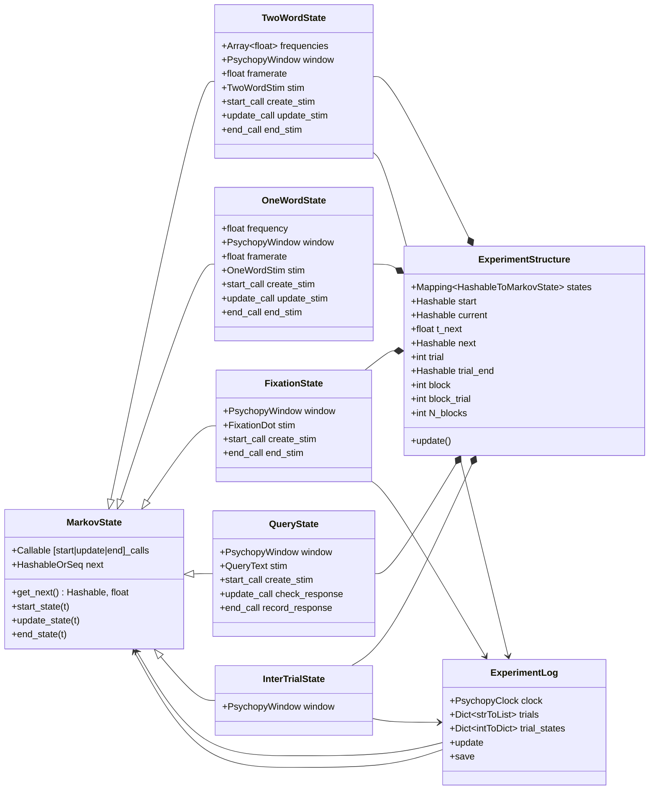

```mermaid
classDiagram
    direction  LR
    class  MarkovState  {
        +Callable  [start|update|end]_calls
        +HashableOrSeq  next
		+get_next()  Hashable,  float
		+start_state(t)
		+update_state(t)
		+end_state(t)
    }
    class  TwoWordState  {
		+Array~float~  frequencies
		+PsychopyWindow  window
		+float  framerate
		+TwoWordStim  stim
		+start_call  create_stim
		+update_call  update_stim
		+end_call  end_stim
    }
    class  OneWordState  {
	    +float  frequency
	    +PsychopyWindow  window
	    +float  framerate
	    +OneWordStim  stim
	    +start_call  create_stim
	    +update_call  update_stim
	    +end_call  end_stim        
    }
    class  FixationState  {
        +PsychopyWindow  window
        +FixationDot  stim
        +start_call  create_stim
        +end_call  end_stim  
    }
    class  QueryState  {
        +PsychopyWindow  window
        +QueryText  stim
        +start_call  create_stim
        +update_call  check_response
        +end_call  record_response
    }
    class  InterTrialState  {
        +PsychopyWindow  window
    }
    MarkovState  <|--  TwoWordState
    MarkovState  <|--  OneWordState
    MarkovState  <|--  FixationState
    MarkovState  <|--  QueryState
    MarkovState  <|--  InterTrialState
    class  ExperimentStructure  {
        +Mapping~HashableToMarkovState~  states
        +Hashable  start
        +Hashable  current
        +float  t_next
        +Hashable  next
        +int  trial
        +Hashable  trial_end
        +int  block
        +int  block_trial
        +int  N_blocks
        +update()
    }
    TwoWordState  --*  ExperimentStructure
    OneWordState  --*  ExperimentStructure
    FixationState  --*  ExperimentStructure
    QueryState  --*  ExperimentStructure
    InterTrialState  --*  ExperimentStructure
    class ExperimentLog  {
        +PsychopyClock  clock
        +Dict~strToList~  trials
        +Dict~intToDict~  trial_states
        +update
        +save
    }
    TwoWordState  -->  ExperimentLog
    MarkovState  <--  ExperimentLog
    FixationState  -->  ExperimentLog
    MarkovState  <--  ExperimentLog
    InterTrialState  -->  ExperimentLog
```
