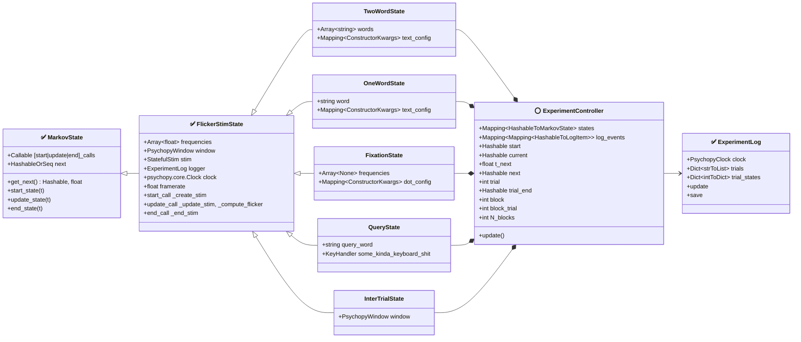

```mermaid
classDiagram
    direction  LR
    class  MarkovState["✅ MarkovState"]  {
        +Callable  [start|update|end]_calls
        +HashableOrSeq  next
		+get_next()  Hashable,  float
		+start_state(t)
		+update_state(t)
		+end_state(t)
    }
    class  FlickerStimState["✅ FlickerStimState"]  {
		+Array~float~  frequencies
		+PsychopyWindow  window
		+StatefulStim  stim
		+ExperimentLog logger
		+psychopy.core.Clock clock
		+float framerate
		+start_call  _create_stim
		+update_call  _update_stim, _compute_flicker
		+end_call  _end_stim
    }
    class  TwoWordState  {
		+Array~string~  words
		+Mapping~ConstructorKwargs~ text_config
    }
    class  OneWordState  {
	    +string  word
	    +Mapping~ConstructorKwargs~ text_config
    }
    class  FixationState  {
        +Array~None~ frequencies
        +Mapping~ConstructorKwargs~ dot_config
    }
    class  QueryState  {
        +string query_word
        +KeyHandler some_kinda_keyboard_shit
    }
    class  InterTrialState  {
        +PsychopyWindow  window
    }
    MarkovState  <|--  FlickerStimState
    FlickerStimState  <|--  TwoWordState
    FlickerStimState  <|--  OneWordState
    FlickerStimState  <|--  FixationState
    FlickerStimState  <|--  QueryState
    FlickerStimState  <|--  InterTrialState
    class  ExperimentController["⭕ ExperimentController"]  {
        +Mapping~HashableToMarkovState~  states
        +Mapping~Mapping~HashableToLogItem~~ log_events
        +Hashable  start
        +Hashable  current
        +float  t_next
        +Hashable  next
        +int  trial
        +Hashable  trial_end
        +int  block
        +int  block_trial
        +int  N_blocks
        +update()
    }
    TwoWordState  --*  ExperimentController
    OneWordState  --*  ExperimentController
    FixationState  --*  ExperimentController
    QueryState  --*  ExperimentController
    InterTrialState  --*  ExperimentController
    class ExperimentLog["✅ ExperimentLog"]  {
        +PsychopyClock  clock
        +Dict~strToList~  trials
        +Dict~intToDict~  trial_states
        +update
        +save
    }
    ExperimentController --> ExperimentLog
```
